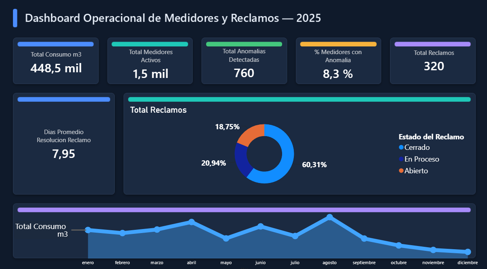
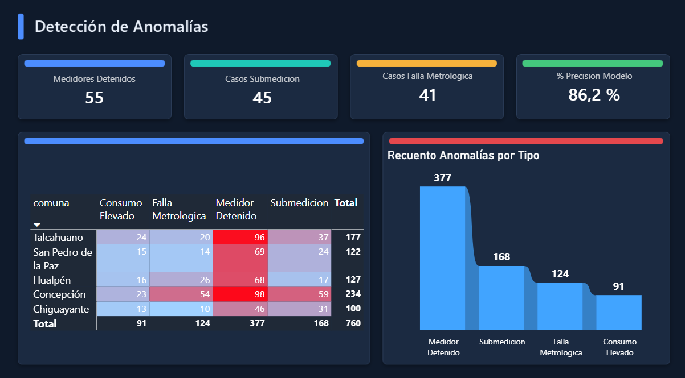
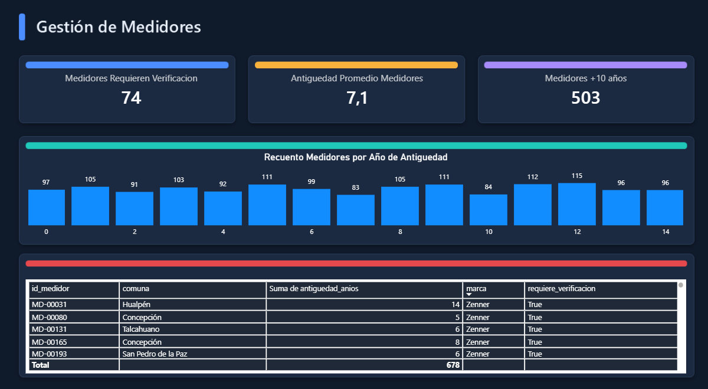
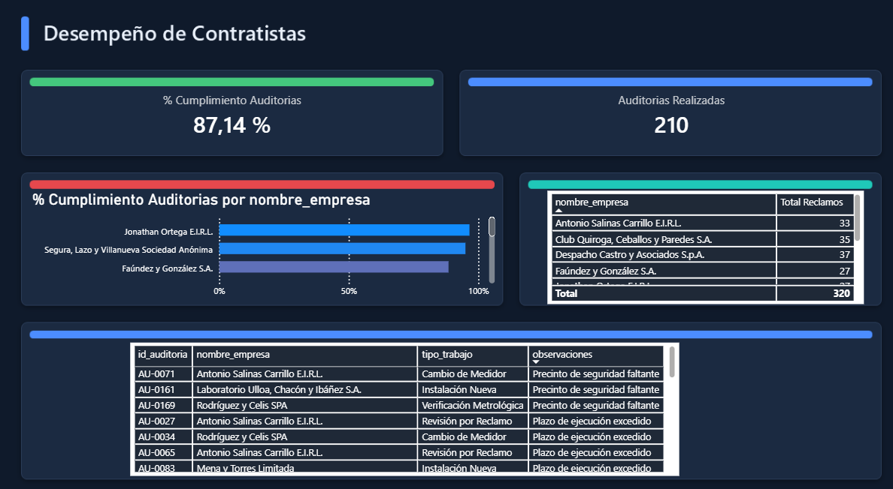

# Sistema de Control de Medición y Detección de Anomalías de Consumo

Proyecto de portafolio orientado a la vacante **Analista de Datos y Control de
Medición** (rubro sanitario, Concepción). Simula el ciclo de datos que
gestionaría ese rol: consumo de clientes, ciclo de vida de medidores,
reclamos y auditorías a contratistas — con foco en **detección de anomalías
de medición** (medidores detenidos, submedición, fallas metrológicas).

> ⚠️ **Nota de datos:** todo el dataset es sintético, generado con `Faker` +
> reglas estadísticas (`generar_dataset.py`). No contiene información real de
> clientes, medidores ni empresas. Se construyó así intencionalmente para
> proteger la privacidad de terceros y de mi empleador actual.

## Arquitectura del proyecto

```
generar_dataset.py        → genera el modelo de datos sintético (6 tablas, ~20.700 registros)
deteccion_anomalias.py    → motor de reglas de negocio que detecta anomalías sobre fact_lecturas
data/*.csv                → tablas listas para cargar en Power BI (modelo estrella)
dashboard/                → archivo .pbix del dashboard (Power BI Desktop)
```

## Vista previa del dashboard

**Página 1 — Resumen Ejecutivo**


**Página 2 — Detección de Anomalías**


**Página 3 — Gestión de Medidores**


**Página 4 — Desempeño de Contratistas**


## Modelo de datos (esquema estrella)

**Tablas de hechos**
| Tabla | Grano | Filas |
|---|---|---|
| `fact_lecturas_anomalias_detectadas.csv` | 1 fila = lectura mensual de un medidor | 18.000 |
| `fact_reclamos.csv` | 1 fila = 1 reclamo de cliente | 320 |
| `fact_auditorias.csv` | 1 fila = 1 auditoría a trabajo en terreno | 210 |

**Tablas de dimensión**
| Tabla | Grano | Filas |
|---|---|---|
| `dim_clientes.csv` | 1 fila = 1 cliente | 1.500 |
| `dim_medidores.csv` | 1 fila = 1 medidor (1:1 con cliente en esta versión) | 1.500 |
| `dim_contratistas.csv` | 1 fila = 1 empresa contratista | 10 |

**Relaciones (Power BI Model View):**
- `dim_clientes[id_cliente]` 1 → * `fact_lecturas[id_medidor]` (vía `dim_medidores`)
- `dim_medidores[id_medidor]` 1 → * `fact_lecturas_anomalias_detectadas[id_medidor]`
- `dim_clientes[id_cliente]` 1 → * `fact_reclamos[id_cliente]`
- `dim_contratistas[id_contratista]` 1 → * `fact_reclamos[id_contratista_asignado]`
- `dim_contratistas[id_contratista]` 1 → * `fact_auditorias[id_contratista]`
- Tabla de fechas (`Calendario`) generada en Power BI, relacionada a `fecha_lectura`, `fecha_reclamo`, `fecha_auditoria`

## Diccionario de datos — campos clave

**`fact_lecturas_anomalias_detectadas.csv`**
| Campo | Descripción |
|---|---|
| `consumo_m3` | Consumo del mes (m³) |
| `tipo_anomalia_real` | Etiqueta "verdadera" simulada (usada solo para validar el modelo, no es un dato operacional real) |
| `tipo_anomalia_detectada` | Resultado del motor de reglas (`Normal`, `Medidor Detenido`, `Submedicion`, `Falla Metrologica`, `Consumo Elevado`) |

**`dim_medidores.csv`**
| Campo | Descripción |
|---|---|
| `antiguedad_anios` | Años desde instalación |
| `requiere_verificacion` | `True` si el medidor tiene ≥5 años sin verificación metrológica registrada |

## Motor de detección de anomalías — reglas de negocio

| Anomalía | Regla aplicada |
|---|---|
| Medidor Detenido | 2+ meses consecutivos con consumo = 0 |
| Submedición | 3+ meses consecutivos con consumo < 60% del promedio histórico del medidor |
| Falla Metrológica | Variación mes a mes > 150% del promedio histórico (lecturas erráticas) |
| Consumo Elevado | Un mes puntual > 2.5x el promedio histórico del medidor |

**Desempeño del modelo** (validado contra la etiqueta simulada, sobre 18.000 lecturas):

| Métrica | Valor |
|---|---|
| Precisión | 86.2% |
| Recall | 62.1% |
| F1-score | 72.2% |
| Detección de "Medidor Detenido" | 100% recall |
| Detección de "Submedición" | 26% recall *(oportunidad de mejora: modelo de tendencia/ML)* |

## Estado del proyecto

- [x] Generación del dataset sintético (Python)
- [x] Motor de detección de anomalías con validación de precisión
- [x] Modelo de datos en estrella con relaciones en Power BI
- [x] 16 medidas DAX
- [x] 4 páginas de dashboard con formato profesional
- [x] Publicación en GitHub
- [ ] Publicación en portafolio personal
- [ ] Publicación en LinkedIn

## Stack técnico
`Python` (pandas, numpy, Faker) · `Power BI` (DAX, modelado estrella) · `Git/GitHub`

---
*Proyecto desarrollado por Daniel Gallardo Monsalves como parte de su portafolio
de transición hacia roles de datos y automatización.*
